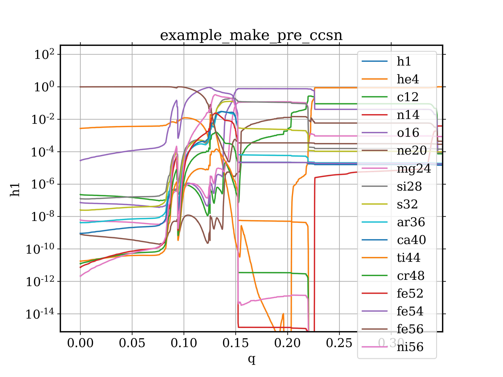
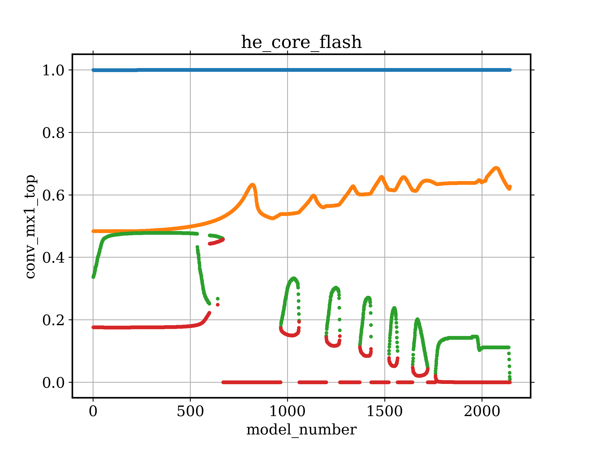

====
qpmg
====

::

  usage: qpmg [-h] filenames [filenames ...]
              [-x X [X ...]] [-y Y [Y ...]] [--xlabel XLABEL [XLABEL ...]]
              [--ylabel YLABEL [YLABEL ...]] [--legend LEGEND [LEGEND ...]] [--style STYLE]
              [--scale-x SCALE_X] [--scale-y SCALE_Y] [--flip-x] [--flip-y]
              [--plotter {plot,semilogx,semilogy,loglog}] [--title TITLE [TITLE ...]]
              [--style-file STYLE_FILE] [--rcParams RCPARAMS [RCPARAMS ...]] [-v]

``qpmg`` is a simple Python script to quickly inspect output that adheres to the
format used by MESA's profiles and histories and GYRE's summaries and mode
files. While ``qpmg`` provides some options, it's intended for quick inspection
rather than publication-quality plots. To see the list of available columns in
a file, run ``qpmg`` on a given file. The defaults will cause an error that
displays the available columns.

positional arguments: ``filenames``

optional arguments:

-h, --help              show this help message and exit
-x X, -y Y              Column(s) to use for the *x* and *y* variables. The code
                        loops through however many *x* and *y* keys you give
                        (inner loop over *x*, outer loop over *y*) but most of the
                        time you probably only want one x variable.
--xlabel XLABEL, --ylabel YLABEL    Overrides the axis label with the given string.
                        Accepts spaces. i.e. 'effective temperature' is OK.
                        Default is to use the first argument of ``-x``/``-y``.
--legend LABELS         If ``auto``, add a legend using the filenames as keys.
                        Otherwise, use the arguments as a list of keys.
                        Default is no legend.
--style STYLE           point style, passed to plot function (default=-)
--scale-x SCALE_X       multiply variables on x-axis by this much (default=1)
--scale-y SCALE_Y       multiply variables on y-axis by this much (default=1)
--flip-x                reverse the x-axis
--flip-y                reverse the y-axis
--plotter PLOTTER       use ``matplotlib.pyplot.PLOTTER`` to plot
                        (one of ``plot``, ``semilogx``, ``semilogy`` or ``loglog``,
			default=plot)
--title TITLE           Adds the given title to the plot. Accepts spaces. i.e.
                        ``my plot`` is OK. Default is no title.
--style-file STYLE_FILE         Specifies a matplotlib style file to load.

Installation
------------

``qpmg`` is available through ``pip``:

::
   
  pip install qpmg

You can also clone this GitHub repo:

::
   
  git clone https://github.com/warrickball/qpmg.git
  cd qpmg
  pip install -e .

or similar.

Finally, the program is entirely constrained in the script ``qpmg``,
so you can download this one file and use it as you please.  For
example, I keep ``$HOME/.local/bin`` in my ``$PATH`` variable, so I
might get the latest version of the script with

::

  wget https://raw.githubusercontent.com/warrickball/qpmg/master/qpmg -O $HOME/.local/bin

Examples
--------

Here are a few examples from the output of MESA's test suite (r10398).

::
   
   qpmg example_make_pre_ccsn/LOGS/profile31.data -x q -y h1 he4 c12 n14 o16 ne20 mg24 si28 s32 ar36 ca40 ti44 cr48 fe52 fe54 fe56 ni56 --plotter semilogy --legend h1 he4 c12 n14 o16 ne20 mg24 si28 s32 ar36 ca40 ti44 cr48 fe52 fe54 fe56 ni56 --title example_make_pre_ccsn

   
::
   
   qpmg he_core_flash/LOGS/history.data -x model_number -y conv_mx1_top conv_mx1_bot conv_mx2_top conv_mx2_bot --style . --title he_core_flash

